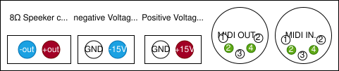
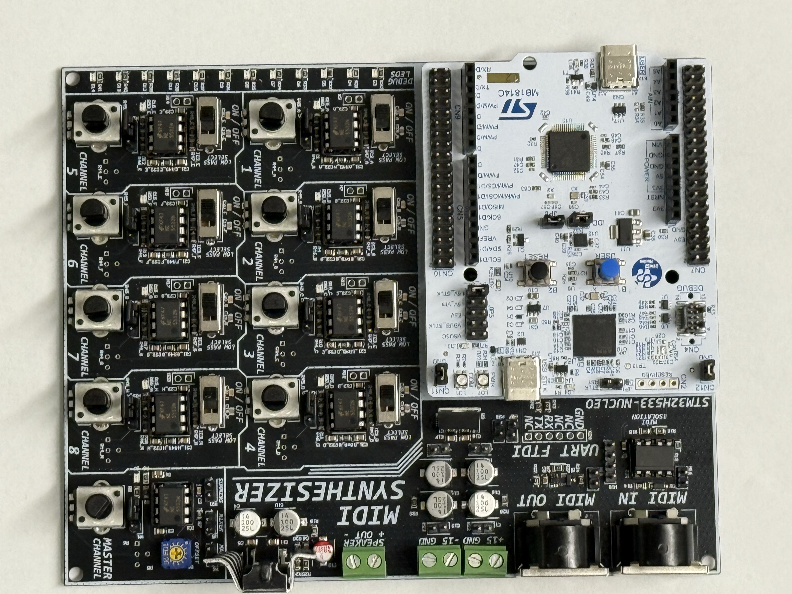

# MIDI Digital Synthesizer

The MIDI Digital Synthesizer is an embedded system capable of interpreting MIDI input signals and synthesizing the audio for the MIDI input.  The project was developed as a final project for the University of Utah's ECE 5780: Embedded Systems class.  While originally planned to be developed on an STM32F072 Discover board, the system now only works with a STM32H533RE NUCLEO board due to limitation's with the Discovery's flash memory as well as clock speed.

Code for the STM32F072 is present within this repository however, it should be noted that this code hasn't been integrated together and thus, doesn't really work in a cohesive system.  That said, the code did represent effort that the Synthetic Bits put in to creating this project and thus, was included in this repository.

## Group Members

- Kenneth Gordon
- Bryant Watson
- Hayoung Im
- Adrian Sucahyo

## Features

The MIDI Digital Synthesizer has the following features:

### Hardware

Microcontroller:
 - STM32H533RE (NUCLEO)

Channels:
 - 7 PWM Channels
     - Sine
     - Triangle
     - Ramp
     - Square
 - 1 DAC
     - Noise

Individual Channel Control:
 - Gain Control
 - Toggleable Low Pass Filter

Master Control:
 - Master Volume Control

Output Speaker Driver:
 - LM1875 Based Class AB Amplifier
 - Up to 20 Watts Driver Capability

### Software

MIDI Interface:
 - MIDI Input
 - MIDI Output

Configurable Channel Waveforms
 - Sine
 - Triangle
 - Ramp
 - Square
 - Noise (Restricted to Channel 8)

Configurable Voice Channels
- Channels 1-4 capable of 4 voices
- Channels 5-8 capable of 1 voice

## Setup Guide

1. Put the NUCLEO on the PCB.
2. Hook up the +-15V power supply as well as the 8 Ohm speaker to the board.
3. Configure your low-pass filters as desired.
4. Connect MIDI (either with the keyboard or through the pin headers)
5. Flash the NUCLEO.
6. Send MIDI to the board.  Mix each of the channels as well as the master channel as desired.
7. _Caution_, the class AB amplifier gets really hot, really quickly.  Don't burn yourself or the board!

Maybe a flow-diagram of the process would be nice here?

Showcase what needs to be connected on a picture of the PCB?

## Board Info
### Front Pannel
the left most connector is the 8 Ohm speaker connector. the left is negitive out and the right is positive out.

The middle 4 connectors control the positive and negative voltage inputs. the connectors start with GND, -15V, GND, +15V. 

the 2 right most connectors are the MIDI IN and MIDI OUT. the MIDI in is used for sending midi commands to the micro contorler for sysntheses, this can connect to a compatible keyboard or computer. The MIDI OUT is not used currently but with future code can be used to send MIDI data to other devices or pass through the MIDI IN.

### Top Down
The right-most device is the embedded board. This connects to to synthesizer board. The blue dots are where a jumper is set we use E5V connector to let the board know to use the external power. All other jumpers are standard and come with the board already in place. There is a Reset button to reset the program and a User button that is not used. Furthermore, the programming for this board uses a USB type C connector on the bottom of the STM32 board. If the user wants to use USB power for testing or MIDI-OUT the user can change the jumper to 15V-STLINK.

The top left section contains Channel 1-8 models. This module is a low-pass filter and amplifier buffer. The ON/OFF controls the low-pass filter. There is a Volume nob that uses a POT. If the more expensive POTS are not available cheap POTs can be used. If cheaper pots are used the jumper must be moved down. 

There is a master channel that mixes the above 8 channels and applies an amplifier buffer. There is also a Volume nob using a POT.

Other Pins on this board were not mentioned above. Some of these are not Jumpers but Debug ports such as the pins near the capacitors near the +15V and -15V.

On the bottom right there are 4 pins near the MIDI IN that can also be used to send MIDI data from a computer using UART. These pins are labeled 3V, RX, TX, and GND.

## Setup instructions
To set up the synthesizer. First, connect an 8 Ohm speaker to the -OUT and +OUT. Next Connect the GND, -15V, and +15V to a duel rail power supply. Make sure the jumper on the embedded board is connected to E5V to use external power. Make sure the power supply is off and connected correctly before turning it on. Next, connect the MIDI-IN on our board to a MIDI-OUT on a keyboard or computer. If the board has not been flashed or programmed do so now using the STLK-USB to program the board. Depending on if a low pass filter is needed for each Channel to turn on and off, this will be unique for each MIDI file or MIDI datastream as each channel can represent different instruments.

## Temporary

This section is notes for us so we don't forget to include things in this document/the rest of the documentation.

Basic instructions on how to set it up
Wiring diagrams
Schematics
Flow charts
Make sure it's organized and written such that it could be of use to an internet stranger interested in the project.
