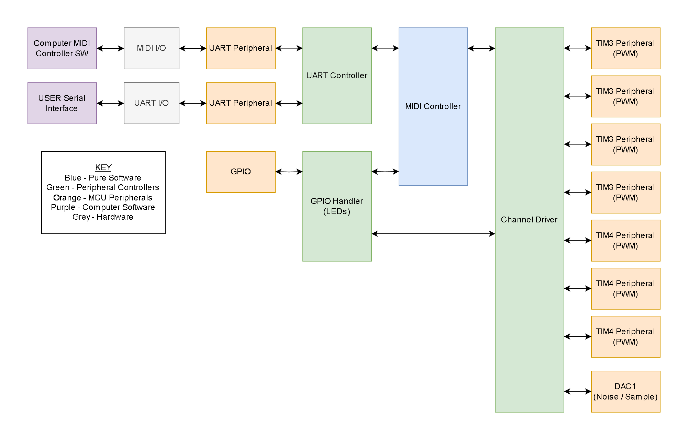
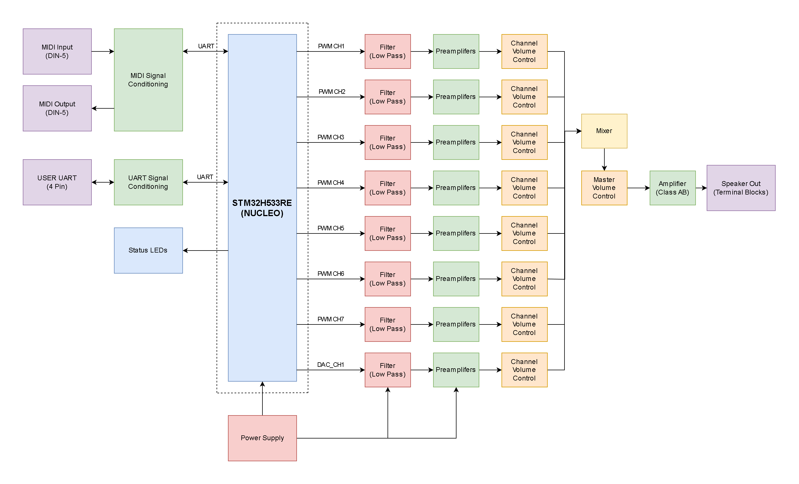
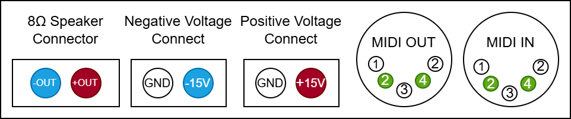
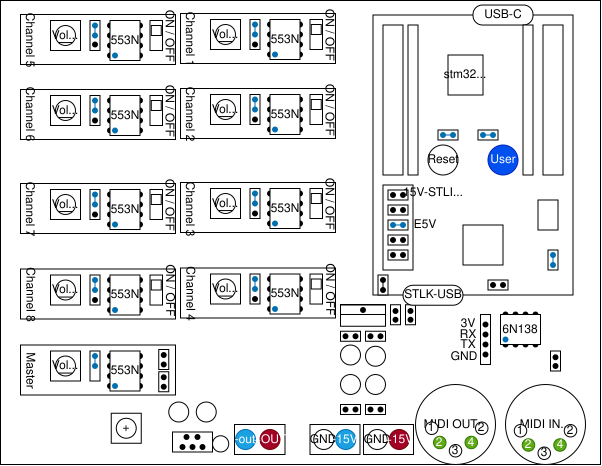
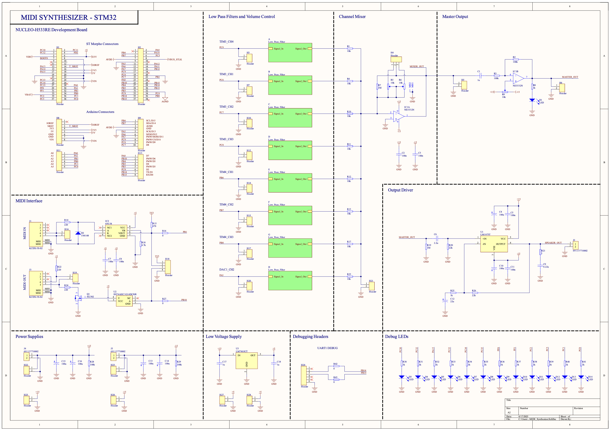
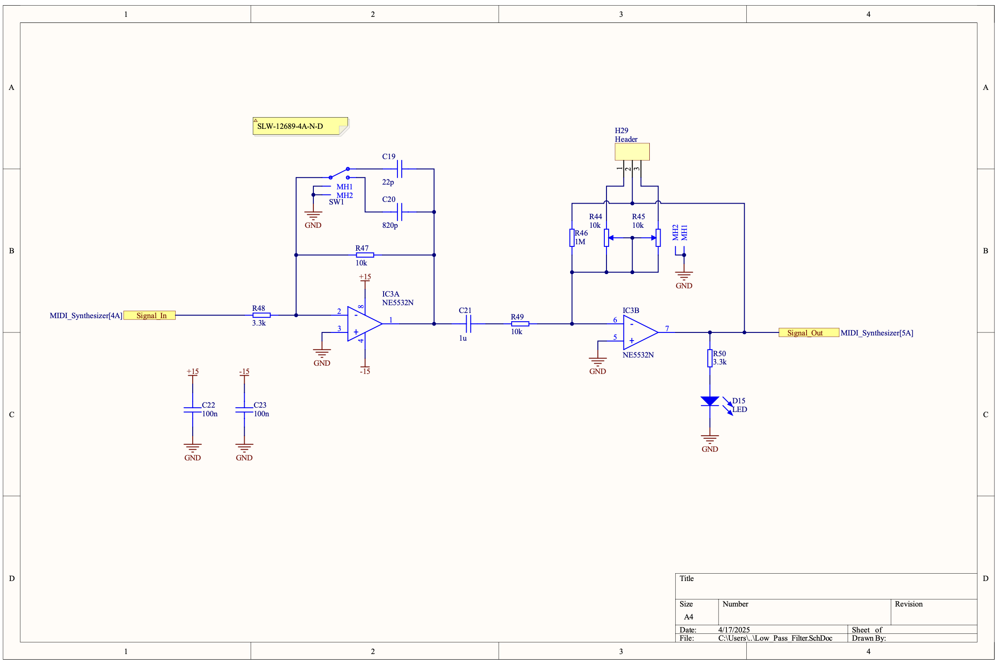
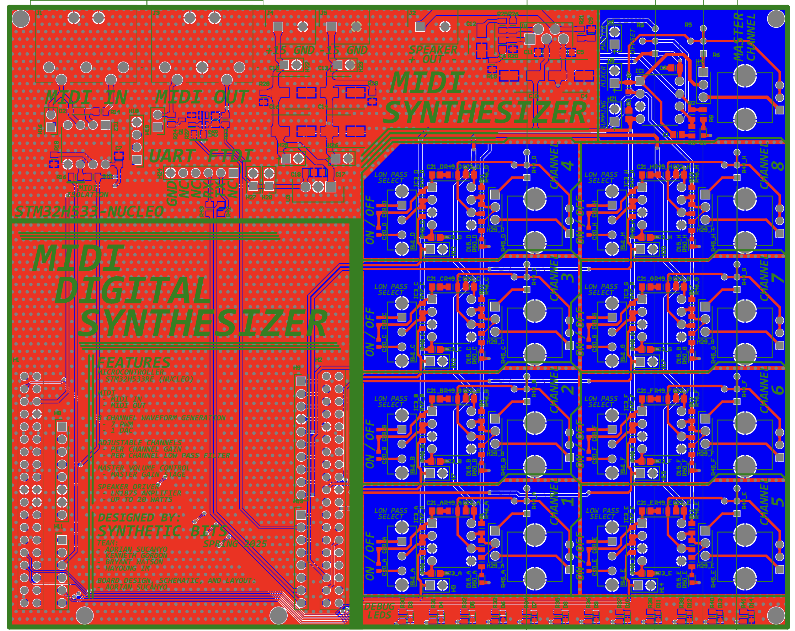

# MIDI Digital Synthesizer

The MIDI Digital Synthesizer is an embedded system capable of interpreting MIDI input signals and synthesizing the audio for the MIDI input. The project was developed as a final project for the University of Utah's ECE 5780: Embedded Systems class. While originally planned to be developed on an STM32F072 Discover board, the system now only works with a STM32H533RE NUCLEO board due to limitation's with the Discovery's flash memory as well as clock speed.

Code for the STM32F072 is present within this repository however, it should be noted that this code hasn't been integrated together and thus, doesn't really work in a cohesive system. That said, the code did represent effort that the Synthetic Bits put in to creating this project and thus, was included in this repository.

## Group Members

- Kenneth Gordon
- Bryant Watson
- Hayoung Im
- Adrian Sucahyo

## Features

The MIDI Digital Synthesizer has the following features:

### Hardware

Microcontroller:
 - STM32H533RE (NUCLEO)

Channels:
 - 7 PWM Channels
     - Sine
     - Triangle
     - Ramp
     - Square
 - 1 DAC
     - Noise

Individual Channel Control:
 - Gain Control
 - Toggleable Low Pass Filter

Master Control:
 - Master Volume Control

Output Speaker Driver:
 - LM1875 Based Class AB Amplifier
 - Up to 20 Watts Driver Capability

### Software

MIDI Interface:
 - MIDI Input
 - MIDI Output

Configurable Channel Waveforms
 - Sine
 - Triangle
 - Ramp
 - Square
 - Noise (restricted to channel 8)

Configurable Voice Channels
- Channels 1-7 capable of 8 voices
- Channels 8 capable of 1 voice

## System Block Diagram

### Software Block Diagram

### Hardware Block Diagram

## Setup Guide

1. Put the STM32H533RE (NUCLEO) board (white) on the synthesizer PCB (black) as seen in the below diagrams.
2. Make sure that the jumper cable on the STM32H533RE (NUCLEO) board is set to the E5V to use external power for the board and PCB system.
3. Connect the +15V, GND, -15V, GND from the power supply to the board. Ensure that the power supply is off and to double check wiring is correct, before turning it on.
4. Connect an 8 Ohm speaker to the board.
5. Configure your low-pass filters as desired, per channel.
    - It's recommended to turn off the volume of each channel and set the master to 50%. 
    - Mix the audio as desired by turning up the volume per channel.
6. Connect the MIDI input to the PCB (either with a MIDI-compliant devices or through the pin headers)
    - If a computer is being used to stream MIDI over UART, you can use the provided Python code to stream a MIDI file to the synthesizer. See the below diagram for what pins should be connected.
7. Flash the NUCLEO board using the USB-C STLINK connector.
8. Send your MIDI input to the board. 
    - Mix each of the channels as well as the master channel as desired.
9. _Caution_, the class AB amplifier gets really hot, really quickly. Don't burn yourself or the board! 
    - It is highly recommended to have a large heat sink.

## Board 

### Front Panel

The leftmost connector on the board is the 8 Ohm speaker connector. The left port of this connector is the negative out and the right port is positive out. Refer to the figures above for wire connections.

The middle four connectors on the board control the positive and negative voltage inputs. The connector ports have the following order: GND, -15V, GND, and +15V. 

The rightmost two connectors are the MIDI IN and MIDI OUT connectors. The MIDI IN is used for sending midi commands to the microcontroller for synthesis. The MIDI IN line can connect to a compatible keyboard or computer for sound synthesis. The MIDI OUT is current not used but was included as future code can be written to send MIDI data to other devices from the synthesizer.

### Top Down

The rightmost device is the the microcontroller board.  This board connects with the main synthesizer board. The blue dots are where a jumper is set.  The E5V connector is used to let the board know to use the external power. All other jumpers are standard and come with the NUCLEO board and the synthesizer board. The NUCLEO board contains a reset button to reset the program and a User button that is currently not used for the synthesizer. Furthermore, the programming for the NUCLEO board uses a USB type C connector on the bottom of the STM32 board. If the user wants to use USB power for testing or MIDI-OUT the user can change the jumper to 5V-STLINK.

The top left section of the board contains the modules for channels 1-8. Each module consists of a low-pass filter and amplifier buffer. The ON/OFF switch controls the low-pass filter. There is a volume nob that uses a potentiometer to control the channel's volume. If the more expensive potentiometers are not available, cheap potentiometers can be used. If cheaper potentiometers are used, the jumper must be moved down. 

The board also has a master channel that mixes and mixes the eight synthesizer channels. The master channel also contains a volume nob using a potentiometer.

There are pins on the main synthesizer board not mentioned above (such as the pins near the capacitors near the +15V and -15V.)  These pins are used for debugging the board.

On the bottom right of the synthesizer board, there are four pins near the MIDI IN that can also be used to send MIDI data from a computer using MIDI-over-UART. These pins are labeled 3V, RX, TX, and GND.

## Board Schematic and PCB

### Schematics

### PCB Design

