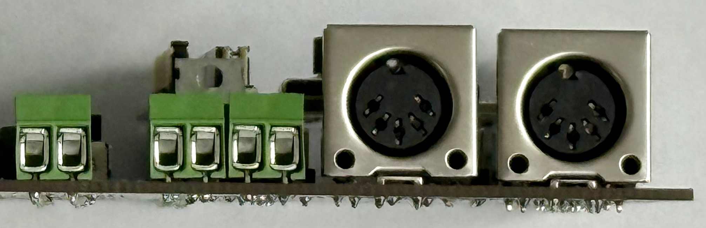

# MIDI Digital Synthesizer

The MIDI Digital Synthesizer is an embedded system capable of interpreting MIDI input signals and synthesizing the audio for the MIDI input.  The project was developed as a final project for the University of Utah's ECE 5780: Embedded Systems class.  While originally planned to be developed on an STM32F072 Discover board, the system now only works with a STM32H533RE NUCLEO board due to limitation's with the Discovery's flash memory as well as clock speed.

Code for the STM32F072 is present within this repository however, it should be noted that this code hasn't been integrated together and thus, doesn't really work in a cohesive system.  That said, the code did represent effort that the Synthetic Bits put in to creating this project and thus, was included in this repository.

## Group Members

- Kenneth Gordon
- Bryant Watson
- Hayoung Im
- Adrian Sucahyo

## Features

The MIDI Digital Synthesizer has the following features:

### Hardware

Microcontroller:
 - STM32H533RE (NUCLEO)

Channels:
 - 7 PWM Channels
     - Sine
     - Triangle
     - Ramp
     - Square
 - 1 DAC
     - Noise

Individual Channel Control:
 - Gain Control
 - Toggleable Low Pass Filter

Master Control:
 - Master Volume Control

Output Speaker Driver:
 - LM1875 Based Class AB Amplifier
 - Up to 20 Watts Driver Capability

### Software

MIDI Interface:
 - MIDI Input
 - MIDI Output

Configurable Channel Waveforms
 - Sine
 - Triangle
 - Ramp
 - Square
 - Noise (Restricted to Channel 8)

Configurable Voice Channels
- Channels 1-4 capable of 4 voices
- Channels 5-8 capable of 1 voice

## Setup Guide

1. Put the NUCLEO on the PCB.
2. Hook up the +-15V power supply as well as the 8 Ohm speaker to the board.
3. Configure your low-pass filters as desired.
4. Connect MIDI (either with the keyboard or through the pin headers)
5. Flash the NUCLEO.
6. Send MIDI to the board.  Mix each of the channels as well as the master channel as desired.
7. _Caution_, the class AB amplifier gets really hot, really quickly.  Don't burn yourself or the board!

Maybe a flow-diagram of the process would be nice here?

Showcase what needs to be connected on a picture of the PCB?

## Setup Diagrams
### Front Pannel

### Top Down

## Temporary

This section is notes for us so we don't forget to include things in this document/the rest of the documentation.

Basic instructions on how to set it up
Wiring diagrams
Schematics
Flow charts
Make sure it's organized and written such that it could be of use to an internet stranger interested in the project.
